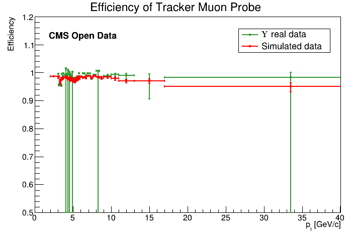
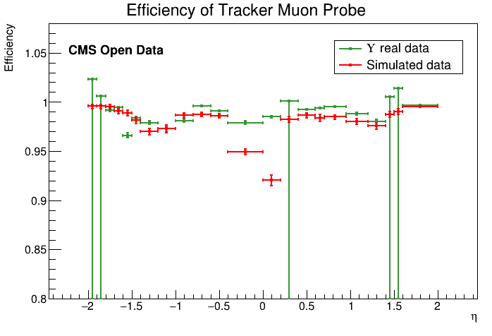
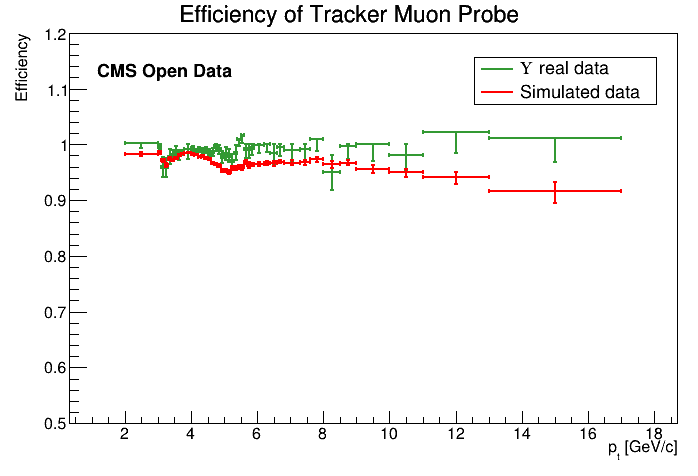
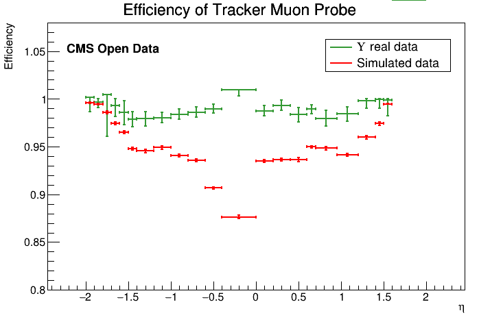
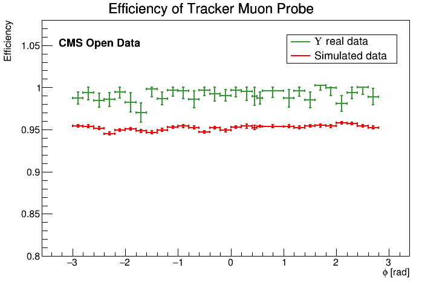

## How sideband subtraction method code stores its files

the Sideband subtraction code saves every efficiency plot in `efficiency/plots/` folder inside a single `generated_hist.root` file. Lets check it!

You're probably on the `main` directory. Lets go back a directory.

~~~
cd ..
ls
~~~
{: .language-bash}

~~~
main  README.md  results  Run2011A_MuOnia_Upsilon.root  Upsilon1SToMuMu_MC_full.root
~~~
{: .output}

A folder named `results` showed up on this folder. Lets go check its content.

~~~
cd results
ls
~~~
{: .language-bash}

~~~
'Comparison_Upsilon_Sideband_Run_vs_MC'  'Upsilon_MC_2020'  'Upsilon_Run_2011'
~~~
{: .output}

If you did every step of the sideband subtraction on this page lesson, these results should match with the results on your pc. Access one of those folders (except comparison).

~~~
cd Upsilo_Run_2011
ls
~~~
{: .language-bash}

~~~
Efficiency_Tracker_Probe_Eta.png  Tracker_Probe_Phi_All.png
Efficiency_Tracker_Probe_Phi.png  Tracker_Probe_Phi_Passing.png
Efficiency_Tracker_Probe_Pt.png   Tracker_Probe_Pt_All.png
Efficiency_Tracker_Tag_Eta.png    Tracker_Probe_Pt_Passing.png
Efficiency_Tracker_Tag_Phi.png    Tracker_Tag_Eta_All.png
Efficiency_Tracker_Tag_Pt.png     Tracker_Tag_Eta_Passing.png
generated_hist.root               Tracker_Tag_Phi_All.png
InvariantMass_Tracker.png         Tracker_Tag_Phi_Passing.png
InvariantMass_Tracker_region.png  Tracker_Tag_Pt_All.png
Tracker_Probe_Eta_All.png         Tracker_Tag_Pt_Passing.png
Tracker_Probe_Eta_Passing.png
~~~
{: .output}

Here, all the output plots you saw when running the sideband subtraction method are stored as a `.png`. Aside from them, there's a `generated_hist.root` that stores the efficiency in a way that we can manipulate it after. This file is needed to run the comparison between efficiencies for the sideband subtraction method. Lets look inside of this file.

Run this command to open `generated_hist.root` with ROOT:

~~~
root -l generated_hist.root
~~~
{: .language-bash}

~~~
root [0] 
Attaching file generated_hist.root as _file0...
(TFile *) 0x55dca0f04c50
root [1]
~~~
{: .output}

Lets check its content

~~~
new TBrowser
~~~
{: .language-bash}

You should see something like this:

This is a visual navigator of a `.root` file. Here you can see the struture of `generated_hist.root`. Double click the folders to open them and see their content. The Efficiency plots we see are stored in `efficiency/plots/`:

You can double click each plot to see its content:

> ## Tip
>
> To close this window, click on terminal and press <kbd>Ctrl + C</kbd>. This command stops any processes happening in the terminal.
> 
{: .callout}

> ## Key Point
> 
> * As you see, the `.root` file has a path inside and the efficiencies plots have paths inside them as well!
> 
{: .keypoints}

## Comparison results between real data and simulations for sideband method

After runinng the sideband subtraction code, we get a `.root` with all the efficiencies plots inside it in two different folders:

* `../results/Upsilon_Run_2011/generated_hist.root`
* `../results/Upsilon_MC_2020/generated_hist.root`

We'll get back to this on the discussion below.

Head back to the `main` folder. Inside of it there is a code for the efficiency plot comparison. Lets check it out.

~~~
cd main
ls
~~~
{: .language-bash}

~~~
classes  compare_efficiency.cpp  config  macro.cpp
~~~
{: .output}

There is it. Now lets open it.

~~~
gedit compare_efficiency.cpp
~~~
{: .language-bash}

Its easy to prepare it for the sideband subtraction comparison. Our main editing point can be found in this part:

~~~
int useScheme = 0;
//Upsilon Sideband Run vs Upsilon Sideband MC
//Upsilon Fitting  Run vs Upsilon Fitting  MC
//Upsilon Sideband Run vs Upsilon Fitting  Run

//Root files and paths for Tefficiency objects inside these files
const char* filePathsEff0[][2] = {
	{"../results/Upsilon_Run_2011/generated_hist.root", "efficiency/plots/Muon_Pt_Tracker_Probe_Efficiency"},
	{"../results/Upsilon_Run_2011/generated_hist.root", "efficiency/plots/Muon_Eta_Tracker_Probe_Efficiency"},
	{"../results/Upsilon_Run_2011/generated_hist.root", "efficiency/plots/Muon_Phi_Tracker_Probe_Efficiency"},
	{"../results/Upsilon_Run_2011/generated_hist.root", "efficiency/plots/Muon_Pt_Standalone_Probe_Efficiency"},
	{"../results/Upsilon_Run_2011/generated_hist.root", "efficiency/plots/Muon_Eta_Standalone_Probe_Efficiency"},
	{"../results/Upsilon_Run_2011/generated_hist.root", "efficiency/plots/Muon_Phi_Standalone_Probe_Efficiency"},
	{"../results/Upsilon_Run_2011/generated_hist.root", "efficiency/plots/Muon_Pt_Global_Probe_Efficiency"},
	{"../results/Upsilon_Run_2011/generated_hist.root", "efficiency/plots/Muon_Eta_Global_Probe_Efficiency"},
	{"../results/Upsilon_Run_2011/generated_hist.root", "efficiency/plots/Muon_Phi_Global_Probe_Efficiency"}
};

//Root files and paths for Tefficiency objects inside these files
const char* filePathsEff1[][2] = {
	{"../results/Upsilon_MC_2020/generated_hist.root", "efficiency/plots/Muon_Pt_Tracker_Probe_Efficiency"},
	{"../results/Upsilon_MC_2020/generated_hist.root", "efficiency/plots/Muon_Eta_Tracker_Probe_Efficiency"},
	{"../results/Upsilon_MC_2020/generated_hist.root", "efficiency/plots/Muon_Phi_Tracker_Probe_Efficiency"},
	{"../results/Upsilon_MC_2020/generated_hist.root", "efficiency/plots/Muon_Pt_Standalone_Probe_Efficiency"},
	{"../results/Upsilon_MC_2020/generated_hist.root", "efficiency/plots/Muon_Eta_Standalone_Probe_Efficiency"},
	{"../results/Upsilon_MC_2020/generated_hist.root", "efficiency/plots/Muon_Phi_Standalone_Probe_Efficiency"},
	{"../results/Upsilon_MC_2020/generated_hist.root", "efficiency/plots/Muon_Pt_Global_Probe_Efficiency"},
	{"../results/Upsilon_MC_2020/generated_hist.root", "efficiency/plots/Muon_Eta_Global_Probe_Efficiency"},
	{"../results/Upsilon_MC_2020/generated_hist.root", "efficiency/plots/Muon_Phi_Global_Probe_Efficiency"}
};

//How comparisons will be saved
const char* resultNames[] = {
	"Muon_Pt_Tracker_Probe_Efficiency.png",
	"Muon_Eta_Tracker_Probe_Efficiency.png",
	"Muon_Phi_Tracker_Probe_Efficiency.png",
	"Muon_Pt_Standalone_Probe_Efficiency.png",
	"Muon_Eta_Standalone_Probe_Efficiency.png",
	"Muon_Phi_Standalone_Probe_Efficiency.png",
	"Muon_Pt_Global_Probe_Efficiency.png",
	"Muon_Eta_Global_Probe_Efficiency.png",
	"Muon_Phi_Global_Probe_Efficiency.png"
};
~~~
{: .language-cpp}

> In the scope above we see:
>
> * `int useScheme` represents which comparison you are doing.
> * `const char* filePathsEff0` is an array with location of the first plots.
> * `const char* filePathsEff1` is an array with location of the second plots.
> * `const char resultNames` is an array with names which comparison will be saved.
> 
> Plots in `const char* filePathsEff0[i]` will be compared with plots in `const char* filePathsEff1[i]`. The result will be saved as `const char* resultNames[i]`.

Everything is uptodate to compare sideband subtraction's results between real data and simulations, except it is comparing standalone and global muons. As we are  looking for tracker muons efficiencies only, you should **delete lines with Standalone and Global words**

> ## See result scructure
> 
> If you deleted the right lines, your code now should be like this:
>
> ~~~
> int useScheme = 0;
> //Upsilon Sideband Run vs Upsilon Sideband MC
> //Upsilon Fitting  Run vs Upsilon Fitting  MC
> //Upsilon Sideband Run vs Upsilon Fitting  Run
> 
> //Root files and paths for Tefficiency objects inside these files
> const char* filePathsEff0[][2] = {
> 	{"../results/Upsilon_Run_2011/generated_hist.root", "efficiency/plots/Muon_Pt_Tracker_Probe_Efficiency"},
> 	{"../results/Upsilon_Run_2011/generated_hist.root", "efficiency/plots/Muon_Eta_Tracker_Probe_Efficiency"},
> 	{"../results/Upsilon_Run_2011/generated_hist.root", "efficiency/plots/Muon_Phi_Tracker_Probe_Efficiency"}
> };
> 
> //Root files and paths for Tefficiency objects inside these files
> const char* filePathsEff1[][2] = {
> 	{"../results/Upsilon_MC_2020/generated_hist.root", "efficiency/plots/Muon_Pt_Tracker_Probe_Efficiency"},
> 	{"../results/Upsilon_MC_2020/generated_hist.root", "efficiency/plots/Muon_Eta_Tracker_Probe_Efficiency"},
> 	{"../results/Upsilon_MC_2020/generated_hist.root", "efficiency/plots/Muon_Phi_Tracker_Probe_Efficiency"}
> };
> 
> //How comparisons will be saved
> const char* resultNames[] = {
> 	"Muon_Pt_Tracker_Probe_Efficiency.png",
> 	"Muon_Eta_Tracker_Probe_Efficiency.png",
> 	"Muon_Phi_Tracker_Probe_Efficiency.png"
> };
> ~~~
> {: .language-cpp}
>
> Let your variables like this.
>
{: .solution}

Now you need to run the code. To do this, save the file and type on your terminal:

~~~
root -l
~~~
{: .language-bash}

~~~
root[0]
~~~
{: .output}

Now run **compare_efficiency.cpp**:

~~~
.x compare_efficiency.cpp
~~~
{: .language-bash}

If everything went right, the message you'll see in terminal at end of the process is:

~~~

Use Scheme: 0
Done. All result files can be found at "../results/Comparison_Upsilon_Sideband_Run_vs_MC/"
root[1]
~~~
{: .output}

And as output plots comparsion, you get:

Now you can type the command below to **quit root** and close all created windows:

~~~
.q
~~~
{: .language-bash}

## How fitting method code stores its files

To do the next part, first you need to understand how the fitting method code saves its files in a different way to the sideband subtraction method code. Lets look at how they are saved.

If you look inside thr results folder for fitting method, you will see another folder named `trackermuon`. Inside of it you'll see:

Inside of them, there are two files:

If you go with your terminal to this folder and run this command, you'll see that the result files only have one plot.\

~~~
root -l Efficiency_Run2011.root
~~~
{: .language-bash}

~~~
root [0] 
Attaching file Efficiency_Run2011.root as _file0...
(TFile *) 0x55f7152a8970
root [1]
~~~
{: .output}

Now lets look at its content.

~~~
new TBrowser
~~~
{: .language-bash}

It has only one plot, because the others are in different files.

> ## Key Point
> 
> * There is a `.root` file for each efficiency plot created with the fitting method.
> 
{: .keypoints}

## Comparison results between real data and simulations for fitting method

Go back to the `main` folder.

~~~
cd main
ls
~~~
{: .language-bash}

~~~
classes  compare_efficiency.cpp  config  macro.cpp
~~~
{: .output}

Open **compare_efficiency.cpp** again

~~~
gedit compare_efficiency.cpp
~~~
{: .language-bash}

This is how your code should look like now:

~~~
int useScheme = 0;
//Upsilon Sideband Run vs Upsilon Sideband MC
//Upsilon Fitting  Run vs Upsilon Fitting  MC
//Upsilon Sideband Run vs Upsilon Fitting  Run

//Root files and paths for Tefficiency objects inside these files
const char* filePathsEff0[][2] = {
	{"../results/Upsilon_Run_2011/generated_hist.root", "efficiency/plots/Muon_Pt_Tracker_Probe_Efficiency"},
	{"../results/Upsilon_Run_2011/generated_hist.root", "efficiency/plots/Muon_Eta_Tracker_Probe_Efficiency"},
	{"../results/Upsilon_Run_2011/generated_hist.root", "efficiency/plots/Muon_Phi_Tracker_Probe_Efficiency"}
};

//Root files and paths for Tefficiency objects inside these files
const char* filePathsEff1[][2] = {
	{"../results/Upsilon_MC_2020/generated_hist.root", "efficiency/plots/Muon_Pt_Tracker_Probe_Efficiency"},
	{"../results/Upsilon_MC_2020/generated_hist.root", "efficiency/plots/Muon_Eta_Tracker_Probe_Efficiency"},
	{"../results/Upsilon_MC_2020/generated_hist.root", "efficiency/plots/Muon_Phi_Tracker_Probe_Efficiency"}
};

//How comparisons will be saved
const char* resultNames[] = {
	"Muon_Pt_Tracker_Probe_Efficiency.png",
	"Muon_Eta_Tracker_Probe_Efficiency.png",
	"Muon_Phi_Tracker_Probe_Efficiency.png"
};
~~~
{: .language-cpp}

You have to do three things:

1. Edit `int useScheme` value to current analysis.

1. Change all second item of arrays in `const char* filePathsEff1[]` and `const char* filePathsEff1[]` to `"Efficiency"`, because is the path inside the `.root`file where all plots are stored.

1. Change all first item of arrays in `const char* filePathsEff1[]` and `const char* filePathsEff1[]` to the location where created file is.

In the end of task, your code should be something like this:

~~~
int useScheme = 1;
//Upsilon Sideband Run vs Upsilon Sideband MC
//Upsilon Fitting  Run vs Upsilon Fitting  MC
//Upsilon Sideband Run vs Upsilon Fitting  Run

//Root files and paths for Tefficiency objects inside these files
const char* filePathsEff0[][2] = {
	{"../[PATH_TO_RESULT_FITTING_FOLDER]/Upsilon/Tracker/pT/Efficiency_Run2011.root", "Efficiency"},
	{"../[PATH_TO_RESULT_FITTING_FOLDER]/Upsilon/Tracker/Eta/Efficiency_Run2011.root", "Efficiency"},
	{"../[PATH_TO_RESULT_FITTING_FOLDER]/Upsilon/Tracker/Phi/Efficiency_Run2011.root", "Efficiency"}
};

//Root files and paths for Tefficiency objects inside these files
const char* filePathsEff1[][2] = {
	{"../[PATH_TO_RESULT_FITTING_FOLDER]/Upsilon/Tracker/pT/Efficiency_MC.root", "Efficiency"},
	{"../[PATH_TO_RESULT_FITTING_FOLDER]/Upsilon/Tracker/Eta/Efficiency_MC.root", "Efficiency"},
	{"../[PATH_TO_RESULT_FITTING_FOLDER]/Upsilon/Tracker/Phi/Efficiency_MC.root", "Efficiency"}
};

//How comparisons will be saved
const char* resultNames[] = {
	"Muon_Pt_Tracker_Probe_Efficiency.png",
	"Muon_Eta_Tracker_Probe_Efficiency.png",
	"Muon_Phi_Tracker_Probe_Efficiency.png"
};
~~~
{: .language-cpp}

Changing `[PATH_TO_RESULT_FITTING_FOLDER]` to the relative path to result folder for fitting method.

Doing this and running the program with:

~~~
root -l compare_efficiency.cpp
~~~
{: .language-bash}

Should get you these results:

## Comparison results between data from the sideband and data from the fitting method

> ## Challenge
>
> Using what you did before, try to mix them and plot a comparison **between real data for sideband method and real data** for sthe fitting method and get an analysis.
> Notice that:
>
> * Real data = Run 2011
> * Simulations = Monte Carlo = MC
>
> Tip: you just need to change what you saw in this page to do this comparison.
>
{: .challenge}

---

> ## Extra challenge
>
> As you did with the last 2 extras challenges, try to redo this exercise comparing results between challenges.
>
{: .challenge}

---

> ## Extra - recreate ntuples
>
> If you are looking go far than this workshop, you can try to recreate those ntuples we used here. Try to get results from a J/ψ decaying in dimuons ntuple @7 TeV. The code used to create them can be [found here](https://github.com/sandrofonseca/TagAndProbe).
> 
> Concerning the datasets used to produce these extra exercises, you can find them in these links below:
>
> * [Real data (2011 legacy)](http://opendata.cern.ch/record/27)
> * [ϒ Monte Carlo simulations](http://opendata.cern.ch/record/1522)
> * [J/ψ Monte Carlo simulations](http://opendata.cern.ch/record/1335)
>
> This is work in progress adapted from CMS official code to create CMS Open Data Tag and Probe ntuples.
>
{: .challenge}

